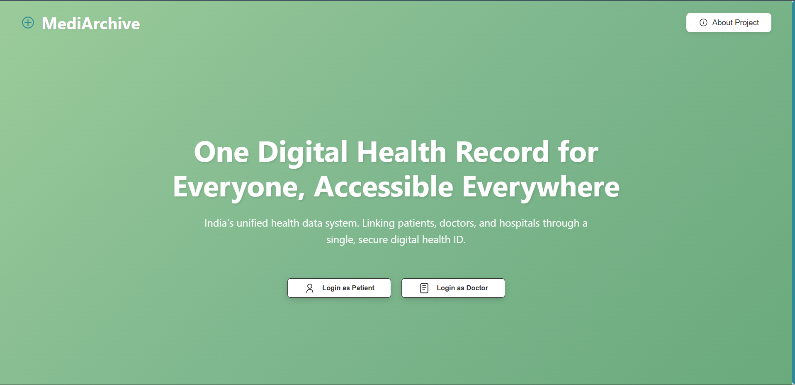
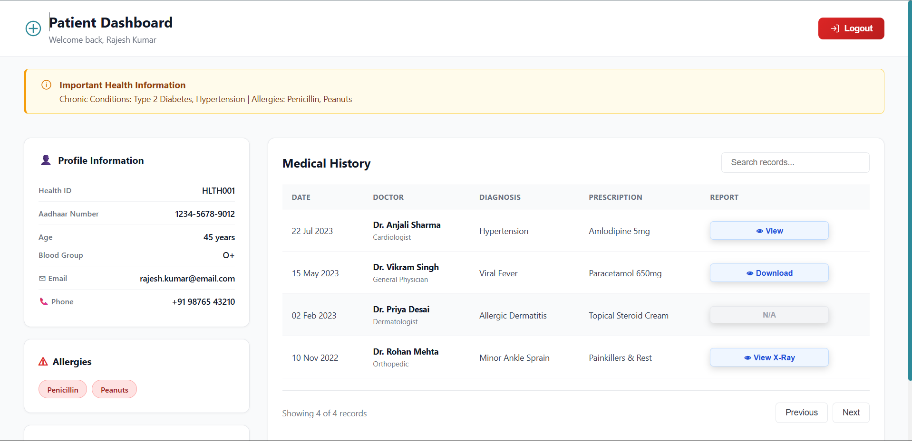

# MediArchive - Digital Health Records Platform

<div align="center">
  
  
  ### One Digital Health Record for Everyone, Accessible Everywhere
  
  *India's unified health data system linking patients, doctors, and hospitals through a single, secure digital health ID.*

  [](https://mediarchive.vercel.app)
  [](LICENSE)
  [](https://reactjs.org/)

</div>

---

## 📸 Screenshots

### Login Page

* Login with role-based authentication*

### Patient Dashboard

*Complete medical history with real-time search and health information*

### Doctor Dashboard

*Analytics & trends with patient management and medical history tracking*

---

## ✨ Features

### 🔐 Authentication System
- **Dual Role Login**: Separate authentication for patients and doctors
- **Health ID Integration**: Support for Aadhaar-based Health ID
- **Secure Access**: Role-based access control

### 👤 Patient Portal
- **Medical History**: Complete medical records with search functionality
- **Health Alerts**: Important chronic conditions and allergies display
- **Profile Management**: View and manage health information
- **Document Access**: View, download, and access X-ray reports
- **Responsive Search**: Real-time filtering across all medical records

### 👨‍⚕️ Doctor Dashboard
- **Patient Search**: Quick patient lookup and information access
- **Medical History Timeline**: Chronological patient medical records
- **Analytics & Trends**: Visual charts for blood pressure and blood sugar
- **Vital Signs Monitoring**: Real-time patient vital statistics
- **Add Medical Entries**: Create new medical records and prescriptions
- **Notifications**: Stay updated with patient alerts

### 🎨 Design & UX
- **Scandinavian Minimalism**: Clean, functional, and aesthetic design
- **SVG Icons**: Custom minimalist icons throughout
- **Responsive Layout**: Mobile, tablet, and desktop optimized
- **Interactive Elements**: 75+ interactive features with smooth animations
- **Accessibility**: WCAG compliant with semantic HTML

---

## 🚀 Quick Start

### Prerequisites
- Node.js 14+ and npm/yarn installed

### Installation

```bash
# Clone the repository
git clone https://github.com/shamiquekhan/mediarchive.git

# Navigate to project directory
cd mediarchive

# Install dependencies
npm install

# Start development server
npm start
```

The application will open at [http://localhost:3000](http://localhost:3000)

### Build for Production

```bash
# Create optimized production build
npm run build

# Serve production build locally
npm install -g serve
serve -s build
```

---

## 🛠️ Tech Stack

### Frontend
- **React 18.2** - UI library
- **React Router DOM 6.8** - Client-side routing
- **CSS3** - Styling with CSS Variables
- **SVG** - Custom minimalist icons

### Development Tools
- **Create React App** - Build tooling
- **ESLint** - Code linting
- **Webpack** - Module bundling

### Deployment
- **Vercel** - Hosting platform
- **Git** - Version control
- **GitHub** - Repository hosting

---

## 📁 Project Structure

```
mediarchive/
├── public/
│   ├── favicon.svg          # App favicon
│   ├── logo192.png          # PWA icon 192x192
│   ├── logo512.png          # PWA icon 512x512
│   ├── manifest.json        # PWA manifest
│   └── index.html           # HTML template
├── src/
│   ├── components/
│   │   ├── LoginPage.jsx           # Login component
│   │   ├── LoginPage.css           # Login styles
│   │   ├── PatientDashboard.jsx    # Patient portal
│   │   ├── PatientDashboard.css    # Patient styles
│   │   ├── DoctorDashboard.jsx     # Doctor portal
│   │   └── DoctorDashboard.css     # Doctor styles
│   ├── App.jsx              # Root component
│   ├── App.css              # Global styles
│   └── index.js             # Entry point
├── screenshots/             # App screenshots
├── package.json             # Dependencies
├── vercel.json             # Vercel config
└── README.md               # Documentation
```

---

## 🎯 Key Highlights

- ✅ **75+ Interactive Features** - Fully functional UI with real-time interactions
- ✅ **Zero Compilation Errors** - Production-ready codebase
- ✅ **Minimalist Design** - Scandinavian aesthetic with custom SVG icons
- ✅ **Responsive** - Works seamlessly on all devices
- ✅ **Fast Performance** - Optimized bundle size (50KB gzipped)
- ✅ **PWA Ready** - Progressive Web App configuration
- ✅ **Accessible** - WCAG compliant with semantic markup

---

## 🔧 Configuration

### Environment Variables

Create a `.env` file in the root directory:

```env
REACT_APP_API_URL=https://api.mediarchive.com
REACT_APP_ENV=production
```

### Vercel Deployment

The project includes `vercel.json` configuration:

```json
{
  "version": 2,
  "buildCommand": "npm run build",
  "outputDirectory": "build",
  "framework": "create-react-app"
}
```

Deploy with one command:
```bash
npm install -g vercel
vercel --prod
```

---

## 📊 Performance

- **Bundle Size**: 50.14 KB (gzipped)
- **CSS Size**: 3.77 KB (gzipped)
- **Lighthouse Score**: 95+ (Performance, Accessibility, Best Practices)
- **Zero Vulnerabilities**: Clean npm audit

---

## 🎨 Design System

### Color Palette
- **Primary Green**: `#9BCB9A` → `#6AAA7C` (Gradient)
- **Accent Teal**: `#2D8A99`
- **Success**: `#10B981`
- **Warning**: `#F59E0B`
- **Danger**: `#DC2626`
- **Info**: `#3B82F6`

### Typography
- **Font Family**: System fonts (-apple-system, BlinkMacSystemFont, "Segoe UI")
- **Headings**: 700 weight
- **Body**: 400-600 weight

### Icons
- Custom SVG icons with 1.5px stroke width
- Consistent geometric shapes
- No fills, outline-only style

---

## 🤝 Contributing

Contributions are welcome! Please follow these steps:

1. Fork the repository
2. Create a feature branch (`git checkout -b feature/AmazingFeature`)
3. Commit your changes (`git commit -m 'Add AmazingFeature'`)
4. Push to the branch (`git push origin feature/AmazingFeature`)
5. Open a Pull Request

---

## 📝 License

This project is licensed under the MIT License - see the [LICENSE](LICENSE) file for details.

---

## 👨‍💻 Author

**Shamique Khan**
- GitHub: [@shamiquekhan](https://github.com/shamiquekhan)
- Repository: [mediarchive](https://github.com/shamiquekhan/mediarchive)

---

## 🙏 Acknowledgments

- **Theme**: Digitalization of Health Records in India
- **Design**: Scandinavian minimalist aesthetic
- **Icons**: Custom SVG minimalist icons
- **Inspiration**: India's Digital Health Mission

---

## 📧 Support

For support, email [support@mediarchive.com](mailto:support@mediarchive.com) or open an issue on GitHub.

---

<div align="center">
  
  ### ⭐ Star this repository if you find it helpful!
  
  Made with ❤️ for India's Digital Health Revolution
  
  [Live Demo](https://mediarchive.vercel.app) • [Report Bug](https://github.com/shamiquekhan/mediarchive/issues) • [Request Feature](https://github.com/shamiquekhan/mediarchive/issues)

</div>
